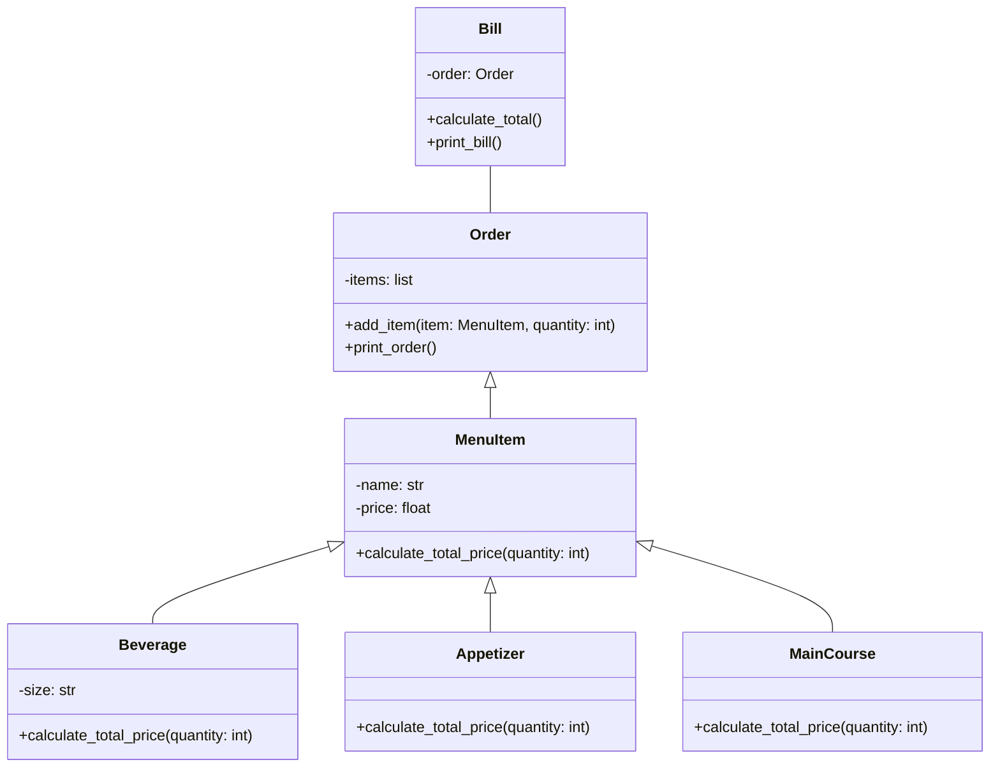
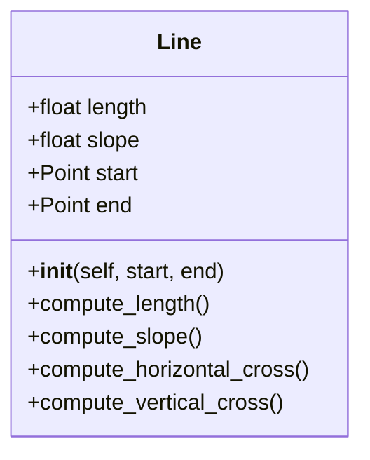

# Mermaid playing ""Cuenta de restaurante"
Este diagrama representa los elementos de un programa para calcular la factura del pedido de un cliente en un restaurante.
***


#Codigo:
```
class MenuItem:
    def __init__(self, name, price):
        self.name = name
        self.price = price

    def total(self, quantity):
        return self.price * quantity


class Beverage(MenuItem):
    def __init__(self, name, price, size):
        super().__init__(name, price)
        self.size = size


class Appetizer(MenuItem):
    pass


class MainCourse(MenuItem):
    pass


class Order:
    def __init__(self):
        self.items = []

    def add_item(self, item, quantity):
        if quantity <= 0:
            raise ValueError("Quantity must be positive.")
        self.items.append((item, quantity))

    def bill(self):
        bill = 0
        for item, quantity in self.items:
            bill += item.total(quantity)
        return bill
    def print_order(self):
        print("Order:")
        for item, quantity in self.items:
            print(f"{item.name} x {quantity}")


menu = {
    "Vino": Beverage("Vino", 65000, "botella"),
    "Agua": Beverage("Agua", 3000, "botella"),
    "Cerveza": Beverage("Cerveza", 10000, "botella"),
    "Papas": Appetizer("Papas", 13000),
    "Alitas": Appetizer("Alitas", 25000),
    "Churazco": MainCourse("Churazco", 45000),
    "Reve eye": MainCourse("Reve eye", 65000),
    "Salmon": MainCourse("Salmon", 55000),
    "Pasta Carbonara": MainCourse("Pasta Carbonara", 35000),
    "Pasta Bolognesa": MainCourse("Pasta Bolognesa", 35000),
}

order = Order()
order.add_item(menu["Vino"], 1)
order.add_item(menu["Alitas"], 1)
order.add_item(menu["Churazco"], 1)
order.add_item(menu["Reve eye"], 1)

order.print_order()
print("Total a pagar:", order.bill())
```

# EJERCCIO DE LINEA 
Este fue el efercicioporpuesto en clase y su solucion 

# Mermaid playing ""Cuenta de restaurante"
Este diagrama representa los elementos de un programa para calcular la factura del pedido de un cliente en un restaurante.
***

```
class Point:
    def __init__(self, x, y):
        self.x = x
        self.y = y


class Line:
    def __init__(self, start_point, end_point):
        self.start_point = start_point
        self.end_point = end_point

    def compute_length(self):
        dx = self.end_point.x - self.start_point.x
        dy = self.end_point.y - self.start_point.y
        return (dx ** 2 + dy ** 2) ** 0.5

    def compute_slope(self):
        dx = self.end_point.x - self.start_point.x
        dy = self.end_point.y - self.start_point.y
        if dx == 0:
            return float('inf')
        else:
            return dy / dx

    def compute_horizontal_cross(self):
        return self.start_point.y == 0 or self.end_point.y == 0

    def compute_vertical_cross(self):
        return self.start_point.x == 0 or self.end_point.x == 0

class Rectangle:
    def __init__(self, top_line, right_line, bottom_line, left_line):
        self.top_line = top_line
        self.right_line = right_line
        self.bottom_line = bottom_line
        self.left_line = left_line

    def area(self):
        return self.top_line.compute_length() * self.right_line.compute_length()

    


p1 = Point(2, 0) 
p2 = Point(6, 4)
line1 = Line(p1, p2)
print("Longitud de la línea:", line1.compute_length())
print("Pendiente de la línea:", line1.compute_slope())
print("Intersección horizontal:", line1.compute_horizontal_cross())
print("Intersección vertical:", line1.compute_vertical_cross())

rectangle = Rectangle(line1, line1, line1, line1)
print("Área del rectángulo:", rectangle.area())
```


