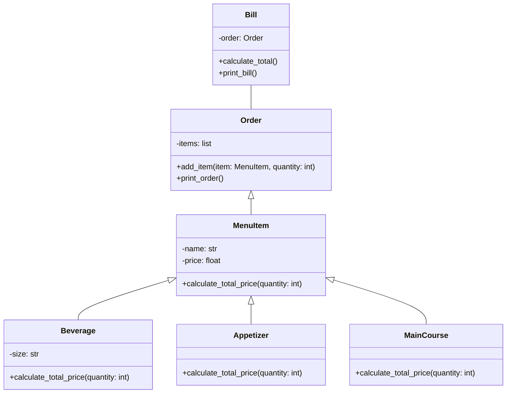

# Mermaid playing ""Cuenta de restaurante"
Este diagrama representa los elementos de un programa para calcular la factura del pedido de un cliente en un restaurante.
***

```mermaid
classDiagram

MenuItem <|-- Beverage
MenuItem <|-- Appetizer
MenuItem <|-- MainCourse
Order <|-- MenuItem
Bill -- Order
class MenuItem{
        -name: str
        -price: float
        +calculate_total_price(quantity: int)
    }
class Beverage{
        -size: str
        +calculate_total_price(quantity: int)
    }
class Appetizer{
        +calculate_total_price(quantity: int)
    }
class MainCourse{
        +calculate_total_price(quantity: int)
    }
class Order{
        -items: list
        +add_item(item: MenuItem, quantity: int)
        +print_order()
    }
class Bill{
        -order: Order
        +calculate_total()
        +print_bill()
    }


```

